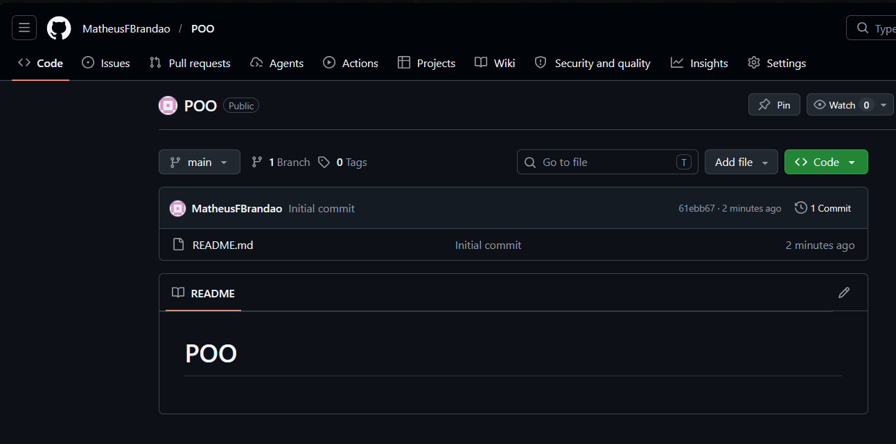
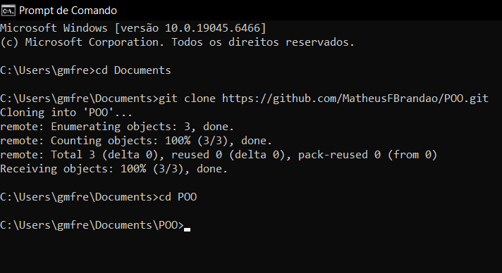
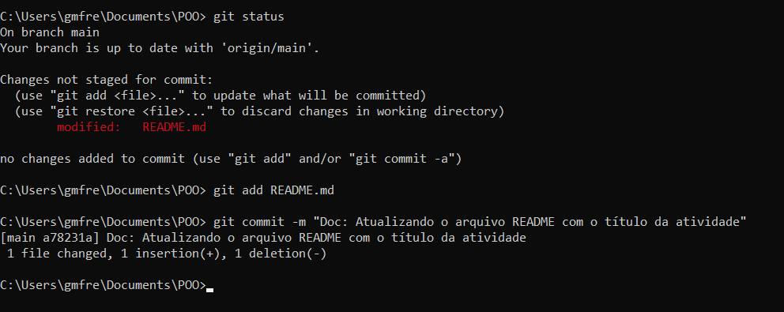
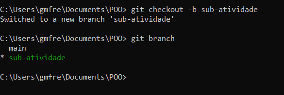
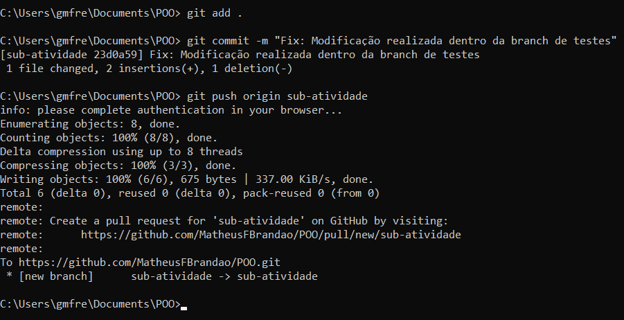

# Relatório de Prática: Uso do Git e GitHub em POO

## 1. Criação e Clonagem de Repositórios
O repositório público 'POO' foi gerado na interface do GitHub e clonado localmente para a máquina de trabalho via terminal.

### Repositório Criado na Nuvem

### Clonagem e Estruturação de Pastas

---

## 2. Edição de Conteúdo e Commits
Modificamos o arquivo `README.md` principal para testar o fluxo local do Git (Área de Preparação e Histórico).

### Processo de Commit Local

---

## 3. Criação e Alteração de Ramos (Branches)
Criamos um ramo paralelo chamado `sub-atividade` para simular o desenvolvimento de uma nova feature sem impactar o código estável da branch `main`.

### Criação e Alternância de Branch

### Envio do Novo Ramo para o GitHub
